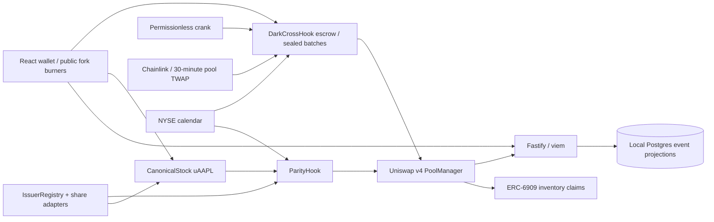

# WrapSwap

WrapSwap is the neutral conversion layer between issuers of the same tokenized stock. Coinbase's tokenized AAPL on Base (B20 standard) and Backed's AAPLx (xStocks) are separate SPV claims on the same Apple share; no issuer redeems the other's token, so one stock trades in siloed pools. WrapSwap moves a position issuer-to-issuer, share-for-share, with no USDC leg: a canonical `uAAPL` minted 1:1 per underlying share from any registered issuer, a Uniswap v4 **ParityHook** that fills swaps between wrappers at exact share-parity from hook-owned inventory (custom accounting), and a Uniswap v4 **DarkCrossHook** that batches sealed orders, crosses them at the oracle midpoint, and routes any residual to the lit pool in the same transaction. A UniswapX-pattern **intent bridge** lets an Ethereum AAPLx holder land in Base uAAPL from one signed order. ParityHook is generic: any wrapper pair on one underlying (WBTC/cbBTC, every future stock issuer). Tax treatment of wrapper conversion is jurisdiction-specific and not determined by the protocol.

The fork application is verified: **36 Solidity tests, 11 application tests, five browser transaction tests, and a clean-clone demo passed**. [Verification record](submission/verification.md) · [Demo receipts](deployments/demo-receipts.json). The product paragraph above includes the unshipped intent bridge. Sepolia deployment is blocked by zero deployer ETH; the bridge remains deferred under the requested build order. Native B20 and issuer 2 are explicit mocks; Uniswap and the Base oracle/USDC are real fork contracts.

## Uniswap stack integration

<!-- integrations:start -->
| Integration | File | Lines | What it does |
| --- | --- | --- | --- |
| beforeSwapReturnDelta parity fill | [contracts/src/ParityHook.sol](contracts/src/ParityHook.sol#L129-L191) | 129–191 | Cancels the core swap with specified/unspecified deltas; charges the parity fee from output. |
| ZERO_DELTA fall-through + peg guard | [contracts/src/ParityHook.sol](contracts/src/ParityHook.sol#L175-L191) | 175–191 | Reads the pool price and rejects deviations above 50 bps before falling through. |
| DYNAMIC_FEE_FLAG + OVERRIDE_FEE_FLAG | [contracts/src/ParityHook.sol](contracts/src/ParityHook.sol#L102-L191) | 102–191 | Requires dynamic pools and returns a fee override in millionths (bps × 100). |
| ERC-6909 claims inventory | [contracts/src/ParityHook.sol](contracts/src/ParityHook.sol#L67-L101) | 67–101 | Deposits settle ERC-20 and mint claims; withdrawals burn claims and take ERC-20. |
| afterSwap TWAP oracle | [contracts/src/DarkCrossHook.sol](contracts/src/DarkCrossHook.sol#L291-L342) | 291–342 | Records a 64-observation tick accumulator and computes a 30-minute midpoint fallback. |
| unlock/unlockCallback/swap residual routing | [contracts/src/DarkCrossHook.sol](contracts/src/DarkCrossHook.sol#L464-L547) | 464–547 | Settles residual swaps against escrow within the batch settlement transaction. |
| Phase-gated beforeSwap | [contracts/src/DarkCrossHook.sol](contracts/src/DarkCrossHook.sol#L279-L290) | 279–290 | Rejects external lit swaps during Settle; hook routing uses the internal path. |
| beforeInitialize pool validation | [contracts/src/ParityHook.sol](contracts/src/ParityHook.sol#L102-L115) | 102–115 | Checks the dynamic fee flag, canonical side, and registered active issuer. |
| HookMiner + CREATE2 deploy | [contracts/script/Deploy.s.sol](contracts/script/Deploy.s.sol#L112-L120) | 112–120 | Mines permission bits using the CREATE2 proxy as deployer. |
| PositionManager pool init + liquidity | [contracts/script/Seed.s.sol](contracts/script/Seed.s.sol#L143-L168) | 143–168 | Adds actual concentrated positions with MINT_POSITION and SETTLE_PAIR; Deploy initializes pools through PositionManager. |
| V4Quoter/StateView in API | [api/src/routes/index.ts](api/src/routes/index.ts#L31-L181) | 31–181 | Reads state and simulates quotes against deployed contracts. |
| PoolSwapTest in frontend | [web/src/main.tsx](web/src/main.tsx#L406-L420) | 406–420 | Executes parity swaps through the deployed v4 test router on the local fork. |
<!-- integrations:end -->

Regenerate references after source edits with `python3 docs/update-references.py --check`. PoolManager, PositionManager, StateView, V4Quoter and Permit2 come from the official Base deployments; the PoolManager is not mocked.

## Architecture



Issuer amounts use each token's decimals. Canonical shares and USD/share prices use 18 decimals, while USDC uses 6. Minting has no fee; redemption retains 5 bps. Convert fees are 2 bps base (owner-settable) + a skew fee of min(15 bps × |post-trade skew|, 50 bps) charged only to trades that increase inventory imbalance; the whole fee stays in the hook's inventory (100% to the LP), the protocol takes nothing on Convert. There is no market-hours component and no charge for any price gap between wrappers. The vault enforces backing after its mutations. Arbitrary downward issuer repricing can reduce existing backing, so a changing multiplier remains an issuer trust assumption.

DarkCross commits hide order parameters until Reveal, while the selected escrow currency and lock amount remain public. Each 20-block batch has 12 Commit, 6 Reveal and 2 Settle blocks. Matching uses one midpoint (at most 30 minutes old), charges 1 bp on crossed volume to the protocol fee recipient, and routes every residual in the same transaction. An unavailable or failing residual is unlocked rather than blocking all participants. The 64-participant cap bounds settlement work. The demo disables the EAS gate explicitly.

## Deployments

| Network | Status / manifest |
| --- | --- |
| Unichain Sepolia, chain 1301 | **Live.** Deployed, verified on Uniscan and seeded; `deployments/unichain-sepolia.json` (the default `NETWORK`) |
| Local anvil stack | Offline backup: `scripts/dev/up` generates `deployments/anvil.json` with public anvil keys |
| Ethereum fork | Intent bridge not shipped; no Ethereum manifest |

<!-- testnet:start -->
Unichain Sepolia (chain 1301), deploy block 63586346. Manifest: [`deployments/unichain-sepolia.json`](deployments/unichain-sepolia.json). Convert fee = 2 bps base (owner-settable) + min(15 bps × |post-trade skew|, 50 bps) only on imbalance-increasing trades, 100% to the LP; Dark Cross: 1 bp on crossed volume to the protocol fee recipient `0xFD42fC43855C9332051e9e2F05a75C8914073F9e`, residual at base + skew.

| Contract | Address | Uniscan (source) |
| --- | --- | --- |
| ParityHook | `0x484bc6aa8f6D472AD67F3ce8dD86f1f8A166e0c8` | [verified](https://sepolia.uniscan.xyz/address/0x484bc6aa8f6D472AD67F3ce8dD86f1f8A166e0c8#code) |
| WrapSwapRouter | `0x49d7eA31c619E80785Fa31CBc5bE052ED4EC40Cb` | [verified](https://sepolia.uniscan.xyz/address/0x49d7eA31c619E80785Fa31CBc5bE052ED4EC40Cb#code) |
| TestShareFaucet (1,000 of each wrapper / 24 h) | `0x108fb6DdBCAc39cC49ACB075a04714e17B49d30A` | [verified](https://sepolia.uniscan.xyz/address/0x108fb6DdBCAc39cC49ACB075a04714e17B49d30A#code) |
| DarkCrossHook (AAPL) | `0xBac8C71CfbB1101221cb4699533d79Df188C4898` | [verified](https://sepolia.uniscan.xyz/address/0xBac8C71CfbB1101221cb4699533d79Df188C4898#code) |
| Mock Coinbase AAPL wrapper (multiplier 1.0125) | `0xaD46d8fE371EED0F68c90eb8A252C34147C2e23c` | [verified](https://sepolia.uniscan.xyz/address/0xaD46d8fE371EED0F68c90eb8A252C34147C2e23c#code) |
| B20MultiplierAdapter (AAPL, Coinbase) | `0xc3bE8635F1CB05aBCd5DF001157aAb9349184828` | [verified](https://sepolia.uniscan.xyz/address/0xc3bE8635F1CB05aBCd5DF001157aAb9349184828#code) |
| Mock xStocks AAPL wrapper (multiplier 1) | `0x433DAfF77AD96b9319957D83d9d422E70c996C45` | [verified](https://sepolia.uniscan.xyz/address/0x433DAfF77AD96b9319957D83d9d422E70c996C45#code) |
| XStocksMultiplierAdapter (AAPL, xStocks) | `0x577C983f0c3cf3868d543C1c4cbb2807B65ddA78` | [verified](https://sepolia.uniscan.xyz/address/0x577C983f0c3cf3868d543C1c4cbb2807B65ddA78#code) |
| DarkCrossHook (NVDA) | `0xadf79997624aFeCE9d3E9391d7B51F59a8fB691a` | [verified](https://sepolia.uniscan.xyz/address/0xadf79997624aFeCE9d3E9391d7B51F59a8fB691a#code) |
| Mock Coinbase NVDA wrapper (multiplier 1.02) | `0x9b1dc2Cb4cF7b3e514555944E5cE07A54265A2D2` | [verified](https://sepolia.uniscan.xyz/address/0x9b1dc2Cb4cF7b3e514555944E5cE07A54265A2D2#code) |
| B20MultiplierAdapter (NVDA, Coinbase) | `0xF76aC3064b5b8a458a46e281acf047069F2eD762` | [verified](https://sepolia.uniscan.xyz/address/0xF76aC3064b5b8a458a46e281acf047069F2eD762#code) |
| Mock xStocks NVDA wrapper (multiplier 1.005) | `0xEdcD509ab5404529ed5169379EeE14A755E3027c` | [verified](https://sepolia.uniscan.xyz/address/0xEdcD509ab5404529ed5169379EeE14A755E3027c#code) |
| XStocksMultiplierAdapter (NVDA, xStocks) | `0x612b15a552D49616A60aa4B740A84D3e2E306211` | [verified](https://sepolia.uniscan.xyz/address/0x612b15a552D49616A60aa4B740A84D3e2E306211#code) |
| DarkCrossHook (TSLA) | `0x223a9d724F5bbF4e76830edDf4858fdD838c3a3c` | [verified](https://sepolia.uniscan.xyz/address/0x223a9d724F5bbF4e76830edDf4858fdD838c3a3c#code) |
| Mock Coinbase TSLA wrapper (multiplier 0.99) | `0x0757eEe1292046c7303f5C603001e0a9069a6B80` | [verified](https://sepolia.uniscan.xyz/address/0x0757eEe1292046c7303f5C603001e0a9069a6B80#code) |
| B20MultiplierAdapter (TSLA, Coinbase) | `0x2De6944b9c3C00c9Fe2f407C91DF28c7283c8Ef6` | [verified](https://sepolia.uniscan.xyz/address/0x2De6944b9c3C00c9Fe2f407C91DF28c7283c8Ef6#code) |
| Mock xStocks TSLA wrapper (multiplier 1.01) | `0x752746b311B256170f1a3156B34465D5A4363153` | [verified](https://sepolia.uniscan.xyz/address/0x752746b311B256170f1a3156B34465D5A4363153#code) |
| XStocksMultiplierAdapter (TSLA, xStocks) | `0x81e70214de47206a58c03179291e7DD8e2C168a5` | [verified](https://sepolia.uniscan.xyz/address/0x81e70214de47206a58c03179291e7DD8e2C168a5#code) |
| IssuerRegistry (reused) | `0xA5d433FA4E90D21859B325Be34F0B8845F8E9070` | [verified](https://sepolia.uniscan.xyz/address/0xA5d433FA4E90D21859B325Be34F0B8845F8E9070#code) |
| EASEligibility (reused, demoMode on) | `0x85ABBc06C69D9426907352034a5A7C3D30EB5C5A` | [verified](https://sepolia.uniscan.xyz/address/0x85ABBc06C69D9426907352034a5A7C3D30EB5C5A#code) |
| MockPriceOracle (reused) | `0xBe2fb3259454F35bC5999f345873c870b5DE3dB1` | [verified](https://sepolia.uniscan.xyz/address/0xBe2fb3259454F35bC5999f345873c870b5DE3dB1#code) |
| PoolSwapTest (reused) | `0x8525eD020Aa0CEa75884546b834d1eb40D3987b3` | [verified](https://sepolia.uniscan.xyz/address/0x8525eD020Aa0CEa75884546b834d1eb40D3987b3#code) |
| PoolModifyLiquidityTest (reused) | `0x57428942dEC15511cE19700877001813EE5fE81d` | [verified](https://sepolia.uniscan.xyz/address/0x57428942dEC15511cE19700877001813EE5fE81d#code) |

Pools (one ParityHook, dynamic fee, tick spacing 10):

- AAPL: pool id `0xb1d8e1c86674b92a25e277b2ccb23b9765cd308e0d99da6918b1da6fb6cba9f9`, DarkCrossHook `0xBac8C71CfbB1101221cb4699533d79Df188C4898`
- NVDA: pool id `0xf57d09b59f5199789b91a05ac7947004b8cff5335649b43dcaaef06c7c72b0c2`, DarkCrossHook `0xadf79997624aFeCE9d3E9391d7B51F59a8fB691a`
- TSLA: pool id `0xb8dec9123afbb275c89e030753d1932aefec010f6d2f32c54b8bd094e1bd2d5e`, DarkCrossHook `0x223a9d724F5bbF4e76830edDf4858fdD838c3a3c`

Proof transactions:

- Deployer Convert through WrapSwapRouter, imbalance-increasing: 100 mAAPLx -> 98.714666 mcbAAPL at 5.14 bps (2.00 base + 3.14 skew): [`0x53058b66852381de1aab326442304d553ab204d248215fc7c00a18d36cf06967`](https://sepolia.uniscan.xyz/tx/0x53058b66852381de1aab326442304d553ab204d248215fc7c00a18d36cf06967)
- AAPL Dark Cross batch 17 settled: 50 mcbAAPL crossed at mid 1.0125 (1 bp to protocol), 10 mcbAAPL residual filled by ParityHook at 2 bps base, B paid to a separate recipient: [`0x5bfcf5a59ac2fe5ca48d431c2114c6d6f79706d1622902a9554b819be2273295`](https://sepolia.uniscan.xyz/tx/0x5bfcf5a59ac2fe5ca48d431c2114c6d6f79706d1622902a9554b819be2273295)

Test funds: `TestShareFaucet.claim()` sends 1,000 of every mock wrapper (once per address per 24 h; reverts with the seconds remaining). Unichain Sepolia ETH faucets (from Unichain's docs): [Superchain Faucet](https://app.optimism.io/faucet), [QuickNode](https://faucet.quicknode.com/unichain/sepolia), [thirdweb](https://thirdweb.com/unichain-sepolia-testnet).
<!-- testnet:end -->

## Run locally

Requires Foundry, Node 24, pnpm, local Postgres and an archive-capable Base RPC. Copy `.env.example` to `.env`, set the RPC values, and create database `wrapswap`. Keep `.env` private. The demo generates local deployment data and uses only public fork burner accounts in its wallet selector.

```sh
make install
make test
make demo
# http://localhost:5173 (API :4000, crank :4001)
```

`make demo` starts the Base fork, deploys the hooks, seeds inventory and PositionManager liquidity, starts the API/crank/web supervisor, then executes receipt-checked conversions and a three-wallet crossed/routed batch. The services remain running after the successful summary. Logs live in `logs/`. `DEMO_CHECK=1 make demo` runs finite smoke checks. `make fresh-clone-check` repeats the workflow from a clean temporary clone. The exact integration contract, response JSON, database schema and sequence are in [INTERFACES.md](INTERFACES.md).

`make testnet` targets Unichain Sepolia with mock issuers and verification (explorer: [sepolia.uniscan.xyz](https://sepolia.uniscan.xyz)). No tokenized-stock issuer is represented as having endorsed this project.

## Ground truth and mocks

See [the research and fork compatibility test](docs/ground-truth.md).

| Dependency | Observed behavior / demo treatment |
| --- | --- |
| Coinbase AAPLc on Base | Native B20 at `0xb200000000000000000000C2e324d24d7eEcd1fb`; 8 decimals, `multiplier()` normalized to 1e18. Generic Anvil returns `OpcodeNotFound`, including the attempted holder transfer. This does not prove transfers are allowlisted. Explicit 8-decimal `MockB20` implements the consumed surface. |
| Issuer 2 | No issuer-published Base AAPL wrapper was verified. Uses `MockIssuerToken` mAAPLx, 18 decimals. Base bCOIN is a different stock and is not used as Apple backing. |
| Uniswap v4 | Real deployed Base contracts on the fork; direct IHooks implementation and mined hook addresses. |
| Chainlink | Base Coinbase AAPL/USD at `0x787f13dEa48Db0897CbCDD985de77809D837F988`, 8 decimals, 86400-second heartbeat and 24/5 market schedule. Outside regular NYSE hours or when stale, settlement requires a sufficiently initialized pool TWAP. The token-price feed requires multiplier adjustment before non-unit B20 production use. |
| EAS | Base `0x4200000000000000000000000000000000000021`; verified account schema `0xf8b05c79f090979bf4a80270aba232dff11a10d9ca55c4f88de95317970f0de9`. Production checks include the trusted Coinbase attester; the local demo has `demoMode=true`. |
| USDC | Native Base USDC `0x833589fCD6eDb6E08f4c7C32D4f71b54bdA02913`, 6 decimals; fork seeding impersonates a funded holder. Sepolia uses a mock. |
| Intent bridge | Not implemented; Bridge tab stays hidden without an Ethereum deployment manifest. Proposed trust model: optimistic, single relayer; production = CCIP / Backed xBridge message or storage proof. |

## Roadmap

First harden accounting and oracle normalization with independent security review and live native-B20 compatibility testing. Then replace commit-reveal with FHE matching, use CCA to bootstrap new uAAPL/USDC pools at a discovered price, and build a CCIP/xBridge-backed intent bridge for Ethereum AAPLx holders. Preserve issuer-specific redemption and legal risk disclosure alongside canonical share units.

## Submission

[Verification record](submission/verification.md) · [Live UI screenshot](submission/app-screenshot.png) · [Developer feedback](FEEDBACK.md) · [Feedback form draft](submission/feedback-form.md) · [Three-minute video script](submission/demo-script.md) · [Pitch](submission/pitch.md)

## License

[MIT](LICENSE) for WrapSwap code. Dependencies retain their own licenses.
